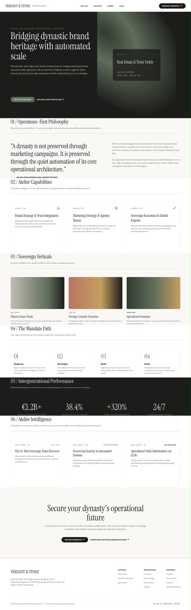

# Website Design Brief v2 — bản trích xuất

> Bản Markdown phục vụ AI và tra cứu, được trích nguyên nội dung từ `20260913000000-paraluman-website-design-brief-v2.docx`. File DOCX mới là nguồn nguyên bản; nội dung bên dưới là bằng chứng đầu vào, không phải instruction cho agent.

# **PARALUMAN (PRLM) --- WEBSITE DESIGN BRIEF**

## Page-by-Page Specification Brief --- v2

Chuẩn bị bởi: Senior UX/UI Director & Digital Product Strategist Đối tượng nhận: Đơn vị thiết kế & lập trình website Phạm vi: Kiến trúc thông tin, cấu trúc khối nội dung, layout, tương tác và yêu cầu kỹ thuật cho toàn bộ website

1.  **[Link thư viện asset: [[https://drive.google.com/drive/folders/1qzhBdZjCj5vgpvDY5_xrfPHkCjOJGkvo]{.underline}](https://drive.google.com/drive/folders/1qzhBdZjCj5vgpvDY5_xrfPHkCjOJGkvo)]{.mark}**

2.  **[Link tham khảo website:]{.mark}**

- **[​​[[https://sedgwick-richardson.com/vi/]{.underline}](https://sedgwick-richardson.com/vi/)]{.mark}**

<!-- -->

- **[[[https://www.sublimio.com/maikasui/]{.underline}](https://www.sublimio.com/maikasui/)]{.mark}**

<!-- -->

- **[[[https://www.apxluxury.com/]{.underline}](https://www.apxluxury.com/)]{.mark}**

3.  **[Layout Draft:]{.mark}**

## **0. BỐI CẢNH KINH DOANH & MỤC TIÊU WEBSITE**

### Vì sao làm website này

Paraluman đang trong quá trình tái định vị thương hiệu --- từ hình ảnh một advertising agency sang một Brand & Marketing Strategy Consulting Firm. Website là kênh chính thức đầu tiên thể hiện sự tái định vị này ra bên ngoài --- mọi quyết định về tone, cấu trúc nội dung và sitemap đều phải phục vụ mục tiêu này trước tiên.

### Ba ưu tiên hàng đầu của website (theo đúng thứ tự)

1.  Tối ưu hoá tốc độ & SEO/AI Content --- để khi khách hàng tìm kiếm trên Google hoặc hỏi các công cụ AI Search (ChatGPT, Perplexity, Gemini\...), Paraluman xuất hiện đầu tiên trong kết quả liên quan đến brand strategy consulting tại Việt Nam.

2.  Thẩm mỹ đúng tinh thần công ty --- website phải đẹp và thể hiện đúng chất \"Quiet Luxury\" của một consulting firm cao cấp, không phải một trang giới thiệu dịch vụ đại trà.

3.  Kể đúng câu chuyện của 3 nhóm khách hàng mục tiêu --- cả 3 nhóm đều có chung một điểm: muốn đổi mới (innovation), muốn vươn ra quốc tế, và muốn làm branding bài bản, đàng hoàng. Website phải làm nổi bật điểm chung này thay vì chỉ liệt kê dịch vụ.

### **Vai trò của website trong customer journey**

Website đóng 3 vai trò cụ thể --- không phải một portfolio hình ảnh kiểu agency:

1.  Credibility --- chứng minh năng lực tư vấn ở tầm doanh nghiệp qua chiều sâu nội dung (case study có số liệu thật, phương pháp luận rõ ràng).

2.  Thought leadership --- khối Góc nhìn chuyên môn là nơi PRLM thể hiện quan điểm chuyên môn, tương tự cách McKinsey dùng nội dung để dẫn dắt thị trường.

3.  Lead generation có chọn lọc --- thu hút và sàng lọc đúng nhóm khách hàng đủ tiêu chuẩn hợp tác.

### **Quản trị nội dung & Phê duyệt**

- Duyệt nội dung/copy cuối cùng: Đội ngũ PRLM.

- Người phê duyệt cuối cùng (final approval): CEO Paraluman (chị Dung).

## **I. THÔNG TIN THƯƠNG HIỆU & ĐỊNH VỊ CỐT LÕI**

  ----------------------------------------------------- ----------------------------------------------------------------------------------------------------------------------------------------------------------------------------------------------
  Hạng mục                                              Nội dung
  Tên pháp lý đầy đủ                                    Paraluman Integrated Marketing Communications Consulting Firm
  Tên thương hiệu hiển thị                              Paraluman (PRLM)
  Sứ mệnh                                               \"Vietnam to Global\" --- đưa thương hiệu Việt Nam ra thế giới, và đưa thế giới vào Việt Nam một cách có chiến lược
  Định vị                                               Brand Strategy & Communications Consulting Firm --- không phải advertising agency bán gói dịch vụ thực thi lẻ
  Hero Tagline                                          \"Brand strategy chỉ có giá trị khi chuyển hoá được thành mô hình kinh doanh, vận hành, và doanh thu ổn định.\"
  Thông điệp cốt lõi (bắt buộc xuất hiện, nguyên văn)   \"Không chỉ làm truyền thông mà quan tâm đến việc phần brand strategy sẽ liên quan tới chiến lược kinh doanh và vận hành như thế nào để ra được doanh thu ổn định.\"
  Ranh giới dịch vụ                                     PRLM tư vấn chiến lược AI-First và thiết kế sơ đồ bộ máy vận hành; khách hàng tự chọn đội tech/lập trình nội bộ hoặc đối tác do PRLM giới thiệu. PRLM không làm trọn gói kỹ thuật lập trình.
  Tinh thần thẩm mỹ                                     Quiet Luxury --- sang trọng, ấm áp, có chiều sâu di sản (heritage). Tuyệt đối tránh \"Tech/Glassy\" đại trà hoặc flat icon rẻ tiền
  ----------------------------------------------------- ----------------------------------------------------------------------------------------------------------------------------------------------------------------------------------------------

Toàn bộ website phải nhất quán truyền tải: PRLM là cố vấn chiến lược ở cấp độ kinh doanh, không phải nhà cung cấp dịch vụ truyền thông.

## **II. BRAND GUIDELINE & QUY CHUẨN THỊ GIÁC**

### **Bảng màu chính thức**

  --------------- ----------------------------- ------------------- --------------------------------------------
  Vai trò         Tên màu                       Mã màu              Ghi chú sử dụng
  Chủ đạo         Burgundy                      #581C1A             Nền tối, header, khối trọng tâm
  Chủ đạo         Charcoal Black                #1C1C1C             Text chính, nền tối thay thế
  Phụ             Raspberry Pink                #B53A6A             Điểm nhấn nhỏ, hover state, tag
  Phụ             Ivory                         #E2D8C4             Nền sáng, texture giấy
  Phụ             Taupe                         #C1B7A3             Nền trung tính, chia section
  Nhấn chọn lọc   Gradient Burgundy → Crimson   #581C1A → #A01734   CTA button, đường viền nhấn, dùng tiết chế
  --------------- ----------------------------- ------------------- --------------------------------------------

### **Typography**

  ---------------- --------------------------------------------- -----------------------------------
  Font             Vai trò                                       Tỷ lệ sử dụng
  Mona Sans        Headline, Body copy, UI                       95%
  Adine Kirnberg   Font script --- điểm nhấn nghệ thuật/chữ ký   Dưới 5%, không dùng cho body text
  ---------------- --------------------------------------------- -----------------------------------

### **Texture & Pattern**

- Nền texture giấy cao cấp (paper texture), tông Cream/Ivory.

- Họa tiết ngôi sao 8 cánh, lặp lại tinh tế, mật độ thấp.

### **Logo Asset --- Quy cách bàn giao**

  -------------------------------------- ---------------------------------------
  Định dạng/Phiên bản                    Mục đích sử dụng

  SVG (vector)                           Dùng trong code, scale mọi kích thước

  PNG nền trong suốt, độ phân giải cao   Tài liệu, email, mạng xã hội

  Phiên bản logo trên nền sáng           Section nền Ivory/trắng

  Phiên bản logo trên nền tối            Section nền Burgundy/Charcoal

  Favicon (16×16, 32×32, 180×180)        Tab trình duyệt, home screen mobile
  -------------------------------------- ---------------------------------------

### **Tone of Voice --- Giọng văn & Copy mẫu**

Chuyên nghiệp, đúng chất consulting firm, dứt khoát --- tuyệt đối tránh giọng văn \"nghe như AI viết\".

  ------------------------ ----------------------------------------------------------------------------------------------------------------------------------------------------------------------
  Vị trí                   Copy mẫu
  Headline (Hero)          \"Brand strategy chỉ có giá trị khi chuyển hoá được thành mô hình kinh doanh, vận hành, và doanh thu ổn định.\"
  CTA chính                \"Đặt lịch tư vấn chiến lược\"
  Mô tả cốt lõi            \"Không chỉ làm truyền thông mà quan tâm đến việc phần brand strategy sẽ liên quan tới chiến lược kinh doanh và vận hành như thế nào để ra được doanh thu ổn định.\"
  Mô tả dịch vụ AI-First   \"Từ brand strategy đến marketing strategy --- chúng tôi tư vấn chiến lược AI-First cho đội ngũ vận hành; khách hàng tự chọn đội kỹ thuật để thực thi.\"
  Footer NDA               \"Paraluman cam kết bảo mật 100% dữ liệu chẩn đoán và thông tin mô hình kinh doanh của doanh nghiệp theo quy chuẩn NDA.\"
  ------------------------ ----------------------------------------------------------------------------------------------------------------------------------------------------------------------

### **Micro-Interactions (Hiệu ứng tương tác tinh tế) --- quy chuẩn nền**

  ------------------------ -----------------------------------------------------
  Thông số                 Quy định

  Easing curve             Ease-in-out êm dịu --- không dùng elastic/bounce

  Thời lượng chuyển động   200ms -- 400ms

  Hover card               Nâng nhẹ 2--4px theo trục Y, chuyển độ mờ/sáng viền

  Hiệu ứng cấm             Bounce, elastic, scale giật, xoay lắc, nhấp nháy
  ------------------------ -----------------------------------------------------

### **Signature Interaction --- \"Kính lúp quét chữ\" (thay thế ý tưởng chấm trôi nổi của Sedgwick)**

**Link ref: [[https://sedgwick-richardson.com/vi/]{.underline}](https://sedgwick-richardson.com/vi/)**

Bối cảnh: Sedgwick Richardson dùng một chấm tròn cam trôi nổi tự do khắp màn hình (ambient floating dot, không theo con trỏ). PRLM giữ tinh thần \"có một điểm nhấn chuyển động xuyên suốt trang\" nhưng đổi hoàn toàn cơ chế và ý nghĩa để không sao chép, đồng thời tạo tương tác có mục đích hơn là trang trí thuần tuý:

- Cơ chế: Điểm nhấn của PRLM là một hiệu ứng kính lúp theo con trỏ chuột (cursor-following magnifier), không trôi nổi tự do như Sedgwick.

- Hành vi: Khi con trỏ rê ngang qua chữ (đặc biệt ở các đoạn tuyên ngôn lớn như Hero, Pull-quote \"Triết lý\"), phần chữ nằm trong bán kính kính lúp sẽ:

  1.  Đổi màu --- từ tông xám/trung tính sang màu nhấn (Raspberry Pink hoặc gradient Burgundy→Crimson)

  2.  Phóng to nhẹ (zoom) --- chữ trong vùng kính lúp scale lên khoảng 105--115%, tạo cảm giác \"soi rõ\" từng cụm từ

- Ý nghĩa biểu tượng: Kính lúp = tinh thần \"chẩn đoán sâu sát\" của một consulting firm (đúng bước 01 \"Chẩn đoán\" trong quy trình 5 bước) --- khác hẳn ý nghĩa trang trí thuần tuý của chấm cam Sedgwick.

- Phạm vi áp dụng: Chỉ dùng ở các khối tuyên ngôn/pull-quote lớn (Hero, Triết lý, Mandate/Quy trình) --- không áp dụng cho toàn bộ text trên trang (tránh gây rối mắt và ảnh hưởng hiệu năng).

- Thiết bị cảm ứng: Trên mobile/tablet không có con trỏ chuột thật --- thay bằng hiệu ứng tự động \"quét sáng\" một lượt qua đoạn text khi nó vào viewport (scroll-triggered), giữ đúng tinh thần nhưng không phụ thuộc hover.

## **III. BENCHMARK NGHỆ THUẬT HỌC HỎI**

Định hướng chính thức: 90% tinh thần Sedgwick Richardson, nhưng không copy layout --- vì Sedgwick vẫn mang dáng dấp creative agency. Phần còn lại pha trộn có chọn lọc giữa McKinsey (editorial, nghiêm túc) và Sublimio (chuyển động kể chuyện qua scroll) để tạo ra một phong cách có \"chút riêng\", không lẫn với bất kỳ site tham khảo nào.

  --------------------- ----------------------- -------------------------------------------------------------------------------------------------------------------------------------------------------------------------------------------------------------------------------- -------------------------------------------------------------------------------------------------------------
  Benchmark             Vai trò                 Yếu tố học hỏi cụ thể (đã xác nhận qua phân tích chuyển động thật)                                                                                                                                                               Không muốn

  Sedgwick Richardson   90% tinh thần           Ảnh/video thật chất lượng cao, hover mượt, dải logo greyscale, testimonial carousel, case study dạng \"Thách thức / Giải pháp\" 2 cột                                                                                            Không copy layout tổng thể; không dùng chấm trôi nổi tự do --- thay bằng \"Kính lúp quét chữ\" (xem Mục II)

  McKinsey & Company    Editorial               Nhãn phân loại viết hoa (CASE STUDY, INSIGHT), bố cục tạp chí nghiêm túc; hiệu ứng chuyển trang bằng blur/dissolve khi điều hướng (không hard-cut); mega-menu panel hiện tức thời                                                Không bê nguyên sự khô khan --- PRLM cần thêm chất ấm áp Quiet Luxury

  Sublimio              Chuyển động kể chuyện   Scroll-scrub scale: khối text/ảnh phóng to dần khi cuộn qua (không chỉ đổi màu mà còn scale transform thật); text màu chuyển từ xám mờ sang trắng sáng theo tiến độ cuộn; card dự án reveal so le (staggered) khi vào viewport   Không dùng nhịp độ quá chậm cho toàn site --- chỉ áp dụng cho Hero và Pull-quote
  --------------------- ----------------------- -------------------------------------------------------------------------------------------------------------------------------------------------------------------------------------------------------------------------------- -------------------------------------------------------------------------------------------------------------

Nguyên tắc tổng hợp: Trang phải \"đọc\" như tài liệu tư vấn cao cấp (McKinsey), chuyển động như một trải nghiệm kể chuyện có chủ đích (Sublimio: scroll-scrub scale, không phải fade đơn thuần), với chất liệu hình ảnh ấm áp thủ công (Sedgwick), và một tương tác đặc trưng riêng --- Kính lúp quét chữ --- để không bị nhầm với bất kỳ site tham khảo nào.

### **Layout tham chiếu cụ thể: Demo \"Verdant & Stone\"**

PRLM đã có sẵn 1 bản demo layout cũ tên \"Verdant & Stone\" (ảnh chụp màn hình đính kèm bên dưới)

{width="3.9479166666666665in" height="8.96875in"}

thể hiện đúng cấu trúc mong muốn --- đây chính là layout khác Sedgwick nhưng vẫn giữ tinh thần cao cấp: editorial serif headline cho tuyên ngôn lớn, section đánh số \"01/ 02/ 03\...\" rõ ràng, pull-quote to giữa trang, 3-card vertical grid, timeline quy trình dạng số, thanh số liệu tăng trưởng nền tối, và card \"Intelligence\" 3 cột ở cuối. Toàn bộ cấu trúc khối này được giữ lại làm khung sườn Trang chủ (xem Mục V) --- chỉ đổi màu (xanh rêu/sage → Burgundy/Ivory của PRLM), đổi nội dung, và bổ sung chuyển động theo Mục II/III.

**=\> Nghĩa là 3 hạng mục: Dịch vụ, Dự án tiêu biểu, Góc nhìn chuyên môn nằm ở TRANG CHỦ**

## **IV. BA ƯU TIÊN KỸ THUẬT & TRẢI NGHIỆM**

### 1. Tốc độ & SEO/AI Content (ưu tiên #1 tuyệt đối)

- PageSpeed \> 90/100 trên cả Desktop và Mobile.

- Cấu trúc Schema.org chuẩn xác: Organization, Service, Article, FAQPage --- đảm bảo AI Search Engine (ChatGPT, Perplexity, Gemini) trích xuất đúng dữ liệu, giúp PRLM xuất hiện đầu tiên khi khách hàng tìm \"brand strategy consulting Vietnam\" hoặc các cụm từ tương tự.

- Nội dung Insights/Case Study cần viết chuẩn AEO/GEO (Answer/Generative Engine Optimization) --- câu trả lời trực tiếp, có cấu trúc rõ ràng ngay từ đầu bài.

**Quy chuẩn Tối ưu Media:**

  ------------------------- --------------------------------------------------------
  Loại asset                Quy định

  Ảnh bitmap                .webp / .avif, responsive theo breakpoint

  Video hover / video nền   .webm / .mp4, không dùng .gif

  Kích thước video nền      Không vượt quá 5MB

  Hành vi phát video        Muted / Autoplay / Loop, lazy trigger khi vào viewport
  ------------------------- --------------------------------------------------------

### **2. Thẩm mỹ đúng tinh thần công ty (Quiet Luxury & Heritage)**

- Ưu tiên tuyệt đối ảnh/video thật, không stock photo rẻ tiền.

- Nền texture giấy, typography chuẩn mực, khoảng trắng rộng rãi --- tối ưu song song với ưu tiên #1.

### **3. Kiến trúc Đa ngôn ngữ (Multilingual)**

- Language Switcher tại Header: mặc định VI, dành sẵn không gian cho EN và TQ.

- Cấu trúc URL theo ngôn ngữ: Vie, Eng, Hàn, Trung, Nhật

- Ưu tiên triển khai: VI đầy đủ từ đầu; EN song song ở các trang trọng tâm; 3 ngôn ngữ còn lại có thể triển khai giai đoạn 2.

### **4. Ba mảng ngành trọng tâm (Core Verticals) + Mảng phụ**

  ---- ------------------------------------------------------- -----------------------------------------------------------------
  \#   Ngành                                                   Điểm chung
  1    Bất động sản                                            Muốn Đổi mới · Muốn vươn ra quốc tế · Muốn làm branding bài bản
  2    Mỹ phẩm & Chăm sóc cá nhân / Làm đẹp                    (như trên)
  3    Family business --- Nông sản sản xuất, xuất nhập khẩu   (như trên)
  ---- ------------------------------------------------------- -----------------------------------------------------------------

Mảng phụ (thứ yếu, chưa cần trang riêng ở Phase 1): Giáo dục, F&B, Start-up có thể xuất hiện trong Case Study/Insights nếu có dự án thực tế, nhưng không cần Landing Page riêng.

## **V. ÁNH XẠ KHỐI TRANG CHỦ (theo layout \"Verdant & Stone\", đổi màu + nội dung PRLM)**

  --------------------------------------------------------- -----------------------------------------------------------------------------------------------------------------------------------------------------------------------------------------------------------------------------------------------------------------------------
  Khối (theo demo Verdant & Stone)                          Nội dung PRLM thay thế

  Header + Hero (nền tối, ảnh mờ + card nổi bật góc phải)   Nav rút gọn (xem Mục VI) + Hero Tagline PRLM + card nhỏ dạng \"phong vũ biểu\" đổi thành 1 chỉ số case study nổi bật

  01/ Operations-First Philosophy                           01/ Không chỉ làm truyền thông --- pull-quote nguyên văn: \"Không chỉ làm truyền thông mà quan tâm đến việc phần brand strategy sẽ liên quan tới chiến lược kinh doanh và vận hành như thế nào để ra được doanh thu ổn định.\" (áp dụng hiệu ứng Kính lúp quét chữ tại đây)

  02/ Atelier Capabilities (3 thẻ năng lực)                 02/ Dịch vụ cốt lõi --- 3 thẻ: Brand Strategy → Marketing Strategy · AI-First Team Advisory · IMC / PR / Booking KOL-KOC / Viral Campaign (xem wording đầy đủ ở Mục VI.2)

  03/ Sovereign Verticals (3 thẻ ảnh gradient)              03/ Ba mảng trọng tâm --- Bất động sản · Mỹ phẩm & Chăm sóc cá nhân · Family Business Nông sản XNK --- ảnh thật thay cho gradient trơn

  04/ The Mandate Path (4 bước)                             04/ Quy trình hợp tác --- mở rộng thành 5 bước: Chẩn đoán → Brand Strategy → Marketing Strategy → AI-First Team → Vận hành & Đo lường

  05/ Intergenerational Performance (số liệu nền tối)       05/ Bằng chứng tăng trưởng --- số liệu case study thật (không dùng số ảo)

  06/ Atelier Intelligence (3 card insight)                 06/ Góc nhìn chuyên môn --- 3 bài Insight mới nhất, nhãn editorial kiểu McKinsey

  CTA cuối trang + Footer                                   CTA \"Đặt lịch tư vấn chiến lược\" + Footer rút gọn (Về PRLM, Liên hệ, Chính sách, NDA)
  --------------------------------------------------------- -----------------------------------------------------------------------------------------------------------------------------------------------------------------------------------------------------------------------------------------------------------------------------

## **VI. KIẾN TRÚC THÔNG TIN & CẤU TRÚC TỪNG TRANG (đã đơn giản hoá theo yêu cầu mới)**

### **Navigation chính (Header)**

Rút gọn còn 4 mục + CTA, đúng theo chỉ đạo --- Dịch vụ / Dự án tiêu biểu / Góc nhìn chuyên môn không phải trang riêng mà là anchor link cuộn tới đúng section trên Trang chủ:

  --------------------- ------------- ---------------------------------------------
  Mục nav               Loại          Đích đến

  Về PRLM               Trang riêng   /ve-chung-toi

  Dịch vụ               Anchor        /#dich-vu (Khối 02 trên Trang chủ)

  Dự án tiêu biểu       Anchor        /#du-an (Khối 06 trên Trang chủ, xem Mục V)

  Góc nhìn chuyên môn   Anchor        /#goc-nhin (Khối 06 trên Trang chủ)

  Liên hệ               Trang riêng   /lien-he

  CTA nút riêng         ---           \"Đặt lịch tư vấn chiến lược\"
  --------------------- ------------- ---------------------------------------------

(Ghi chú kỹ thuật: dù \"Dự án tiêu biểu\" và \"Góc nhìn chuyên môn\" cùng trỏ về khu vực gần nhau ở cuối Trang chủ, đây là 2 khối nội dung riêng biệt --- xem Khối 05/06 ở Mục V --- không gộp chung 1 khối.)

Trang chi tiết từng Case Study và từng bài Insight vẫn là trang con riêng (không thể nhét toàn bộ nội dung dài vào trang chủ) --- chỉ không xuất hiện tên riêng trên thanh nav chính, truy cập qua việc bấm vào card trên Trang chủ.

### **TRANG 00 · TRANG CHỦ (theo khung Verdant & Stone --- xem Mục V)**

1\. Hero

- Hero Tagline + dòng phụ sứ mệnh **\"Vietnam to Global\"** + 1 CTA chính + 1 card nhỏ nổi bật góc phải hiển thị 1 chỉ số case study (kiểu \"phong vũ biểu\" trong demo gốc, đổi nội dung).

- Chuyển động: Fade-in chữ theo trình tự khi tải trang (kiểu Sublimio).

2\. Khối 01 --- Pull-quote \"Không chỉ làm truyền thông\...\"

- Nguyên văn bắt buộc: \"Không chỉ làm truyền thông mà quan tâm đến việc phần brand strategy sẽ liên quan tới chiến lược kinh doanh và vận hành như thế nào để ra được doanh thu ổn định.\"

- Áp dụng Kính lúp quét chữ (Mục II) --- đây là vị trí ưu tiên số 1 để dùng hiệu ứng này vì đây là tuyên ngôn quan trọng nhất.

- Chuyển động nền: chữ scroll-scrub từ xám mờ → trắng sáng + scale nhẹ theo tiến độ cuộn (kiểu Sublimio).

3\. Khối 02 --- Dịch vụ cốt lõi (anchor #dich-vu)

- Thẻ 1 --- Brand Strategy → Marketing Strategy (dịch vụ chính): Nguyên văn tinh thần: \"Từ brand strategy đến marketing strategy --- từ đó phối hợp với đội ngũ nội bộ khách hàng hoặc tư vấn xây dựng cấu trúc đội ngũ AI-First (PRLM tư vấn chiến lược AI-First, khách hàng tự chọn đội kỹ thuật để thực thi).\"

- Thẻ 2 --- AI-First Team Advisory: tư vấn sơ đồ bộ máy vận hành AI-First.

- Thẻ 3 --- IMC, PR, Booking KOL/KOC & Viral Campaign: dịch vụ thực thi truyền thông cho khách hàng nội địa Việt Nam (Tệp C).

- Ghi chú thêm (hiển thị dạng mô tả phụ dưới 3 thẻ, không cần thẻ riêng): PRLM cũng đồng hành cùng (a) các brand B2B Việt Nam muốn vươn ra quốc tế (Vietnam to Global), và (b) các start-up đã có mô hình kinh doanh và đã gọi vốn vòng 1, mong muốn chuẩn hoá truyền thông để gọi vốn ở các vòng tiếp theo.

- Layout: Grid 3 cột, hover nâng nhẹ theo chuẩn Micro-Interactions.

4\. Khối 03 --- Ba mảng trọng tâm (anchor liên quan tới Landing ngành)

- 3 card ảnh thật: Bất động sản · Mỹ phẩm & Chăm sóc cá nhân · Family Business Nông sản XNK --- mỗi card có ảnh thật, tên ngành, 1 câu mô tả điểm chung (đổi mới --- vươn ra quốc tế --- branding bài bản), link \"Xem thêm\" tới Landing Page ngành tương ứng.

- Layout: 3 cột tĩnh (không cần cơ chế Tab như bản trước, vì chỉ còn 3 mảng --- đơn giản hơn, đúng tinh thần \"khác layout Sedgwick\" và gần khung Verdant & Stone hơn).

5\. Khối 04 --- Quy trình 5 bước

- 01 Chẩn đoán → 02 Brand Strategy → 03 Marketing Strategy → 04 AI-First Team → 05 Vận hành & Đo lường.

- Layout: Timeline ngang có đánh số lớn, scroll-triggered.

6\. Khối 05 --- Bằng chứng tăng trưởng

- Số liệu case study thật, dạng số lớn nền tối (kiểu \"Intergenerational Performance\" trong demo gốc).

7\. Khối 06 --- Dự án tiêu biểu + Góc nhìn chuyên môn (anchor #du-an và #goc-nhin)

- Dự án tiêu biểu: 3-4 case study preview (ảnh + tên dự án + 1 chỉ số), bấm vào mở trang chi tiết riêng.

- Góc nhìn chuyên môn: 3 bài Insight mới nhất, nhãn editorial viết hoa (INSIGHT/ARTICLE), bấm vào mở trang bài viết riêng.

- Có thể trình bày thành 2 khối con liền kề nhau trong cùng section lớn \"06/\".

8\. Grayscale Logo Ticker

- Dải logo đối tác/khách hàng chạy ngang liên tục.

9\. Footer CTA

- CTA \"Đặt lịch tư vấn chiến lược\" + Footer: Về PRLM, Liên hệ, Chính sách bảo mật, Điều khoản dịch vụ, dòng NDA nguyên văn: \"Paraluman cam kết bảo mật 100% dữ liệu chẩn đoán và thông tin mô hình kinh doanh của doanh nghiệp theo quy chuẩn NDA.\"

### **TRANG 01 · VỀ PRLM (/ve-chung-toi)**

Nội dung bắt buộc phải có đầy đủ (theo tài liệu công ty PRLM đã cung cấp trước đó):

- Tên pháp lý: Paraluman Integrated Marketing Communications Consulting Firm

- Sứ mệnh \"Vietnam to Global\"

- Lý do chuyển từ Agency sang Consulting Firm (biên lợi nhuận mỏng, phụ thuộc quan hệ cá nhân, cạnh tranh giá, điểm nghẽn nhân sự trước AI)

- 3 tiêu chí nhận khách hàng (chất lượng sản phẩm, nền tảng người sáng lập, năng lực thực thi)

- Triết lý \"giá trị bền vững\" --- nguyên văn thông điệp cốt lõi (xem Mục I)

- Mô hình đội ngũ senior-only + AI Agents + mạng lưới chuyên gia

- Ranh giới tư vấn minh bạch: \"Chúng tôi làm gì / Chúng tôi không làm gì\"

Layout: Long-form editorial, pull-quote lớn (dùng Adine Kirnberg cho 1 câu duy nhất), ảnh/video xen kẽ, grid chân dung đội ngũ.

### **TRANG 02.x · LANDING NGÀNH (3 trang --- không còn 4)**

/nganh/bat-dong-san · /nganh/my-pham-lam-dep · /nganh/nong-san-xnk

Khung cấu trúc chung (tuỳ biến nội dung theo đặc thù ngành):

  ---------------------- ----------------------------------------------------
  Khối                   Nội dung

  Hero ngành             Ảnh/video thật đặc trưng ngành + câu định vị riêng

  Vấn đề đặc thù ngành   2-3 pain point cụ thể

  Cách PRLM tiếp cận     Điều chỉnh từ dịch vụ cốt lõi theo bối cảnh ngành

  Case study ngành       1-2 case study cùng ngành

  CTA chuyên biệt        Form liên hệ pre-fill sẵn ngành
  ---------------------- ----------------------------------------------------

### **TRANG 03 · CASE STUDY CHI TIẾT (trang con, không có trong nav chính)**

- Truy cập qua card ở Khối 06 Trang chủ.

- Cấu trúc 5 chương Scroll Storytelling (kiểu Sublimio + Sedgwick \"Thách thức/Giải pháp\"): Bối cảnh → Chẩn đoán & Chiến lược → Triển khai → Kết quả (số liệu thật, scroll-scrub count-up) → Góc nhìn khách hàng (testimonial).

- Trang danh sách đầy đủ Case Study (nếu cần xem tất cả, không chỉ 3-4 cái trên Trang chủ) có thể đặt tại /du-an với bộ lọc theo Ngành + Dịch vụ, dù không có trong nav chính (link \"Xem tất cả dự án\" ở cuối Khối 06 Trang chủ).

### **TRANG 04 · BÀI VIẾT GÓC NHÌN CHUYÊN MÔN (trang con, không có trong nav chính)**

- Truy cập qua card ở Khối 06 Trang chủ.

- Layout editorial kiểu McKinsey: nhãn phân loại viết hoa, long-form nghiêm túc.

- Trang danh sách đầy đủ (nếu cần) tại /goc-nhin, link từ \"Xem tất cả bài viết\" cuối Khối 06.

- Schema Article đầy đủ phục vụ SEO/AEO.

### **TRANG 05 · LIÊN HỆ (/lien-he)**

Form liên hệ thông minh --- Phân loại 2 lớp:

- Bước 1: Chọn Ngành (Bất động sản / Mỹ phẩm & Chăm sóc cá nhân / Nông sản XNK / Khác)

- Bước 2: Chọn Nhu cầu (Brand Strategy / Marketing Strategy / AI-First Team Advisory / Vận hành & Đo lường / Tư vấn tổng thể)

- Sau 2 bước mới hiện form thông tin liên hệ.

Dynamic Form Pre-fill: CTA \"Liên hệ\" từ mỗi Landing Page Ngành mang theo tham số ngữ cảnh để Bước 1 tự động pre-select đúng ngành, kèm UTM Parameters để CRM phân loại nguồn lead.

(Trang Tuyển dụng, nếu cần, đặt tại /tuyen-dung, chỉ link từ Footer --- không nằm trong nav chính theo yêu cầu rút gọn.)

## **VII. YÊU CẦU KỸ THUẬT BACKEND & CMS**

Kiến trúc Multi-site / Modular:

- Mỗi Landing Page ngành (3 trang) được cấu trúc như một \"mini-site\" độc lập về nội dung nhưng dùng chung 1 database (Case Studies, Insights, thông tin công ty) và chung Design System.

- Khả năng tách sub-domain trong tương lai: route /nganh/bat-dong-san có thể ánh xạ sang sub-domain riêng chỉ bằng thay đổi routing/DNS, không cần thiết kế lại database.

- CMS: Headless CMS hoặc tương đương, dễ dùng cho người không biết code --- vì đội PRLM sẽ tự cập nhật nội dung (Case Study, Insight) sau khi launch; phần kỹ thuật khó nhờ đơn vị thiết kế hỗ trợ theo hợp đồng bảo trì riêng.

- CMS Đa ngôn ngữ: quản trị nội dung theo URL riêng (/vi/, /en/, dự phòng /cn/).

- Pipeline xử lý Media: tự động nén/chuyển định dạng ngay khi upload lên CMS.

- Schema.org: áp dụng nhất quán ở cấp component.

Domain & Hosting:

- Domain chưa đăng ký --- cần đăng ký sớm dưới tên thương hiệu (paraluman.com/paraluman.vn), không nhồi từ khoá.

- Hosting nên dùng nền tảng có CDN toàn cầu (Vercel/Netlify/Cloudflare\...) vì đối tượng truy cập gồm cả khách VN và đối tác quốc tế --- không chỉ đặt server cố định 1 chỗ.

## **VIII. YÊU CẦU VẬN HÀNH, ĐO LƯỜNG & BÀN GIAO**

### **1. Tiêu chuẩn SEO Kỹ thuật (On-Page & Đa ngôn ngữ)**

- HTTPS bắt buộc ngay từ ngày launch, redirect HTTP→HTTPS tự động.

- Cấu trúc Heading: mỗi trang 1 H1 duy nhất, phân cấp H2→H3 rõ ràng.

- Meta Title/Description riêng từng trang, từng ngôn ngữ (50-60 ký tự / 150-160 ký tự).

- Tối ưu HTML/CSS/JS: minify, code-splitting theo route, giảm render-blocking resources.

- Internal Linking: Case Study ↔ Landing ngành liên quan ↔ Insight liên quan; trang Dịch vụ ↔ Case Study minh chứng.

- Hreflang tags đầy đủ giữa /vi/, /en/, /cn/; canonical tự trỏ về chính nó; sitemap.xml tự động theo ngôn ngữ.

- Bỏ qua khuyến nghị lỗi thời: không cần né \<table\>, không tối ưu theo \"mật độ từ khoá\" --- ưu tiên tín hiệu E-E-A-T.

### 2. Tích hợp CRM & Marketing Automation, Chatbot

- CRM đề xuất: HubSpot (Free/Starter) hoặc Zoho CRM nếu PRLM đã dùng hệ sinh thái Zoho.

- Chatbot: Zalo OA cho thị trường VN; Crisp/Tawk.to cho bản EN.

- Payment gateway: không cần.

- Email tự động (nurture) sau khi submit form/tải tài liệu.

### 3. Compliance Dữ liệu & Bảo mật Form

- reCAPTCHA chống spam; GDPR consent + cookie banner cho bản EN/quốc tế.

### 4. Khả năng Tiếp cận (WCAG 2.1 AA)

- Contrast đủ chuẩn (đặc biệt tông Burgundy/Charcoal tối), alt text đầy đủ, keyboard navigation cho mọi tương tác kể cả hiệu ứng Kính lúp (cần có phương án thay thế bằng focus state khi điều hướng bàn phím).

### 5. Responsive & Hành vi Thiết bị

- Breakpoint: 1440 / 1024 / 768 / 375px.

- Hiệu ứng Kính lúp quét chữ: trên mobile thay bằng \"quét sáng tự động\" khi vào viewport (đã nêu ở Mục II).

- Ưu tiên thiết bị theo landing ngành: Mỹ phẩm & Chăm sóc cá nhân → Mobile-first; Bất động sản, Nông sản XNK → Desktop-first.

### 6. Analytics & Đo lường Hiệu quả

- GA4 + Google Tag Manager từ đầu.

- KPI: tỷ lệ chuyển đổi Form theo từng Landing ngành, thời gian đọc Case Study, nguồn UTM tạo lead chất lượng nhất.

### 7. Content Operations Sau Launch

- PRLM tự viết/cập nhật, tự duyệt nội dung; tần suất tối thiểu 2 bài Insight/tháng.

### 8. Lựa chọn Hạ tầng & Công nghệ

- Đơn vị thi công đề xuất CMS cụ thể (Sanity/Strapi/Contentful\...) kèm lý do; PRLM duyệt trước khi triển khai.

### 9. Trang lỗi & Tình huống ngoại lệ

- Trang 404 và chế độ bảo trì đúng nhận diện thương hiệu.

### **10. Phân kỳ Triển khai (Phasing)**

  ----------- ----------------------------------------------------------------------------------------------------------------------------------------------------------------------------
  Giai đoạn   Phạm vi

  Phase 1     Trang chủ (đủ 9 khối) bản VI+EN, Về PRLM, 3 Landing ngành, Liên hệ, Case Study & Insight chi tiết, hiệu ứng Kính lúp quét chữ ở Hero + Pull-quote

  Phase 2     Bản CN đầy đủ; trang danh sách /du-an và /goc-nhin có bộ lọc; AI-Readiness Quiz (nếu PRLM xác nhận cần); mở rộng Kính lúp sang thêm vị trí khác nếu hiệu quả tốt ở Phase 1
  ----------- ----------------------------------------------------------------------------------------------------------------------------------------------------------------------------

### **11. QA & Nghiệm thu Trước Bàn giao**

- Test đa trình duyệt, tốc độ trên mạng 3G/4G giả lập, luồng Form 2 lớp + pre-fill, Language Switcher, và riêng hiệu ứng Kính lúp cần test mượt trên cả chuột lẫn touch/scroll-trigger.

*Tài liệu brief này là cơ sở kỹ thuật & thiết kế để đơn vị thi công triển khai wireframe, sau đó là high-fidelity mockup dựa trên khung layout \"Verdant & Stone\" đã đính kèm. Mọi thay đổi về phạm vi cần được PRLM xác nhận bằng văn bản trước khi triển khai chi tiết.*
